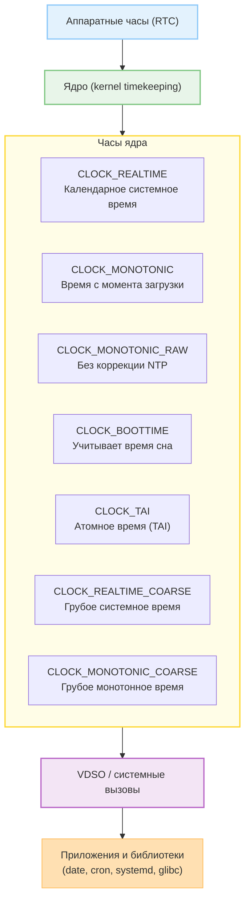

Когда вы работаете с Linux, кажется, что «время» одно: вот `date` показывает дату, и более ничего.  

На самом деле, в системе существует несколько независимых представлений времени, каждое из которых обслуживает свой уровень — аппаратный, системный или пользовательский.

Это разделение нужно, чтобы одновременно обеспечивать:
- точное представление календарного времени (для журналов, файлов и пользователей),
- стабильное, монотонное измерение интервалов (для планировщика, таймеров, профилирования),
- независимость от ручных/сетевых коррекций времени.


Виды:
1) RTC (Real-Time Clock) 
2) CLOCK_REALTIME
3) CLOCK_MONOTONIC, CLOCK_MONOTONIC_RAW, CLOCK_BOOTTIME
4) Jiffies, tick, внутренние счётчики
5) clocksource, clockevent
6) VDSO (virtual dynamic shared object)
7) CLOCK_TAI, CLOCK_REALTIME_COARSE


# RTC (Real-Time Clock) - аппаратные часы

Что это:
- Небольшой чип на материнской плате, питающийся от батарейки.
- Сохраняет время даже при выключенном питании.
- Работает независимо от ОС; часто управляется через BIOS/UEFI.

Зачем:
- Система при старте знает «какое сейчас время».
- RTC - первичный источник времени, от которого ядро «запускает» системные часы при загрузке.
- Для поддержания функций запуска по таймеру.

Работа с RTC:
```bash 
sudo hwclock --show   # выведет текущее время
```

Синхронизация:
```bash
sudo hwclock --hctosys   # из RTC в системное
sudo hwclock --systohc   # из системного в RTC
```

> [!warning] Как время хранится в RTC
> Обычно это UTC (Linux, MacOS и т.д), но есть системы которые хранят локальное время (Windows по умолчанию). Это важно для случаев dual-boot систем


# CLOCK_REALTIME - системное время

Что это:
- Главное "время системы".
- Представляют текущее календарное время (год, месяц, часы, минуты, секунды).
- Отсчитываются от эпохи Unix: 1 января 1970 г. UTC.
- Работает независимо от ОС; часто управляется через BIOS/UEFI.
- Могут быть изменены пользователем (`date -s`) или сетевыми службами (NTP, chrony).

Зачем:
- Для отображения времени пользователю (date, журналы, timestamp файлов).
- Для расчёта календарных событий (cron, systemd timers).
- Используется в файловых системах для меток.

Особенности:
- Может сдвигаться назад или вперёд
- Нельзя использовать для измерения длительности — возможен «прыжок» времени.
- Привязан к часовому поясу и локализации.


> [!warning] Пример "прыжка", если во время функции `do_some_work()` произойдет корректировка времени, то `elapsed` не сможет выдать точный результат замера.
> ```c
struct timespec start, end;
clock_gettime(CLOCK_REALTIME, &start);
do_some_work();
clock_gettime(CLOCK_REALTIME, &end);
double elapsed = end.tv_sec - start.tv_sec;
printf("Elapsed: %.2f sec\n", elapsed);
>```

Основные команды:
- `clock_gettime(CLOCK_REALTIME, timespec)` - получить время.
- `clock_settime(CLOCK_REALTIME, timespec)` - установить время. 

```c
struct timespec {
   time_t   tv_sec;        /* seconds */
   long     tv_nsec;       /* nanoseconds */
};
```

# CLOCK_MONOTONIC - монотонные часы

Что это:
- Внутренний счётчик, который только увеличивается с момента загрузки.
- Начинается с 0 при старте системы.
- Не зависит от RTC и от корректировок календарного времени.

Зачем:
- Измерение интервалов, задержек, таймаутов.
- Используется планировщиком процессов, таймерами (`sleep`, `poll`, `epoll`).
- Обеспечивает стабильность измерений (нет "прыжков").

Особенности:
- Может быть слегка скорректирован (`NTP`, `adjtimex`) для учёта дрейфа,
но не изменяется скачками.
- Не связан с календарём и часовыми поясами.

Основные команды:
- `clock_gettime(CLOCK_MONOTONIC)` - получить время от загрузки.


# VDSO - Virtual Dynamic Shared Object

Что это:
- Механизм, через который ядро передаёт пользователю актуальное время без системного вызова.
- Библиотека `linux-vdso.so` мапится в адресное пространство каждого процесса.

Зачем:
- Чтобы ускорить `clock_gettime()` и `gettimeofday()` — не нужно переходить в режим ядра (экономия десятков наносекунд).
- Особенно важно для высоконагруженных систем, где миллионы вызовов времени в секунду.



