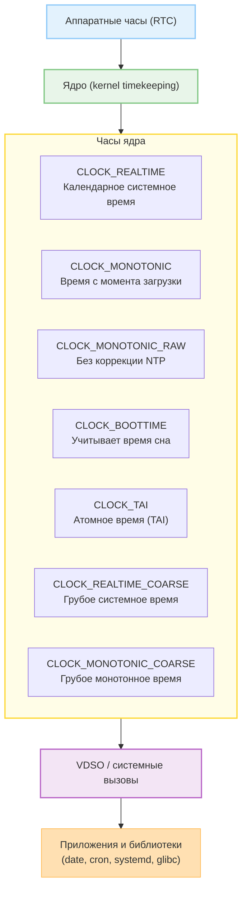

Когда вы работаете с Linux, кажется, что «время» одно: вот `date` показывает дату, и более ничего.  

На самом деле, в системе существует несколько независимых представлений времени, каждое из которых обслуживает свой уровень — аппаратный, системный или пользовательский.

Это разделение нужно, чтобы одновременно обеспечивать:
- точное представление календарного времени (для журналов, файлов и пользователей),
- стабильное, монотонное измерение интервалов (для планировщика, таймеров, профилирования),
- независимость от ручных/сетевых коррекций времени.


Виды:
1) RTC (Real-Time Clock) 
2) CLOCK_REALTIME
3) CLOCK_MONOTONIC, CLOCK_MONOTONIC_RAW, CLOCK_BOOTTIME
4) Jiffies, tick, внутренние счётчики
5) clocksource, clockevent
6) VDSO (virtual dynamic shared object)
7) CLOCK_TAI, CLOCK_REALTIME_COARSE


# RTC (Real-Time Clock) - аппаратные часы

Что это:
- Небольшой чип на материнской плате, питающийся от батарейки.
- Сохраняет время даже при выключенном питании.
- Работает независимо от ОС; часто управляется через BIOS/UEFI.

Зачем:
- Система при старте знает «какое сейчас время».
- RTC - первичный источник времени, от которого ядро «запускает» системные часы при загрузке.
- Для поддержания функций запуска по таймеру.

Работа с RTC:
```bash 
sudo hwclock --show   # выведет текущее время
```

Синхронизация:
```bash
sudo hwclock --hctosys   # из RTC в системное
sudo hwclock --systohc   # из системного в RTC
```

> [!warning] Как время хранится в RTC
> Обычно это UTC (Linux, MacOS и т.д), но есть системы которые хранят локальное время (Windows по умолчанию). Это важно для случаев dual-boot систем



